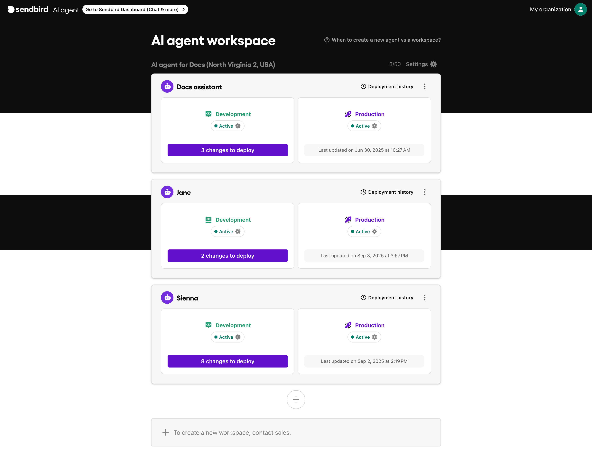

# AI agent (home)

The **AI agent home** gives you a centralized view of all AI agents within your workspace.

<figure><figcaption>
AI agent list view
</figcaption></figure>

## What you can do

* View all AI agents in your [workspace](ai-agent-home.md#workspace-vs-ai-agent) at a glance
* [Check each agent’s environment status](ai-agent-home.md#development-vs-production-environments) (Development / Production)
* [See which changes are pending deployment with a breakdown of updated items](ai-agent-home.md#see-changes)
* [Deploy changes to Production](ai-agent-home.md#deploy-to-production)
* [View deployment history](ai-agent-home.md#viewing-deployment-history)
* [Create new AI agents](ai-agent-home.md#creating-a-new-ai-agent)
* [Enable or disable an AI agent](ai-agent-home.md#managing-ai-agents-operational-state)


**Note:** The AI agent list view may vary based on your [role and permission](https://ai-docs.sendbird.com/roles-and-permissions) settings within the workspace.


***

### Development vs Production environments

When you create a new AI agent, it automatically comes with two environments:

* **Development** — a sandbox for testing, editing, and validating your agent before going live.
* **Production** — the live version users interact with.

Modifications in Development do not impact the live agent until they are deployed to Production.

***

### Viewing changes

If there are updates in the Development environment that haven’t been deployed, a **changes to deploy** badge will appear on the agent card.

<figure><figcaption></figcaption></figure>

A modal will then pop up with a detailed list of items that were modified. You can review the changes and choose to deploy all or selectively deploy changes.

<figure><figcaption></figcaption></figure>

***

### Deploying to Production

Use the **Deploy to production** button to publish changes from an agent’s Development environment to its Production version.

**Selective deployment**

With **selective deployment**, you have full control over which AI agents receive workspace-level changes. For example, when you update a shared Actionbook or Knowledge item, you can choose which agents should receive the new version in Production.

This allows you to:

* Gradually roll out updates to specific agents
* A/B test different flows across agents
* Avoid unintended changes to agents that share the same workspace assets

<figure><figcaption></figcaption></figure>

***

### Viewing deployment history

Click **Deployment history** on any agent card to view past deployments.

<figure><figcaption></figcaption></figure>

Each record shows:

* The version number
* Who deployed it
* When it was deployed
* Details of the modified items


**Note:** If you do not have member permission, deployment records will display as `No permission` .


***

### Creating a new AI agent

<figure><figcaption></figcaption></figure>

Click the ➕ icon at the bottom of the agent list to create a new agent. You'll be asked to:

* Name the agent (visible to users)
* Each new agent will come with both a [Development and Production](ai-agent-home.md#development-vs-production-environments) environment.


**Note:** To delete an agent, contact sales.


***

### Managing AI agent's operational state

<figure><figcaption>
Deactivating an AI agent
</figcaption></figure>

You can toggle an agent between **Active** and **Inactive**:

* **Active**: The AI agent is up and running, and available to users.
* **Inactive**: The agent stops operating, and the specified fallback message will be sent as a response instead.


**Note**: Toggling the agent in one environment doesn’t affect the other.


***

### Workspace vs AI agent

* **Workspace**: A region-based container. All agents in a workspace share assets such as Knowledge, Actionbooks, Tools, and Message templates.
* **Agent**: A unique setup with its own behavior, language, and use case.

Use this rule of thumb:

* **Create a new workspace** if you need to serve users in a completely different region (e.g. US vs Korea).
* **Create a new agent** if you want to serve different audiences, policies, or languages within the same region.


**Note:** To create a new workspace, contact sales.

