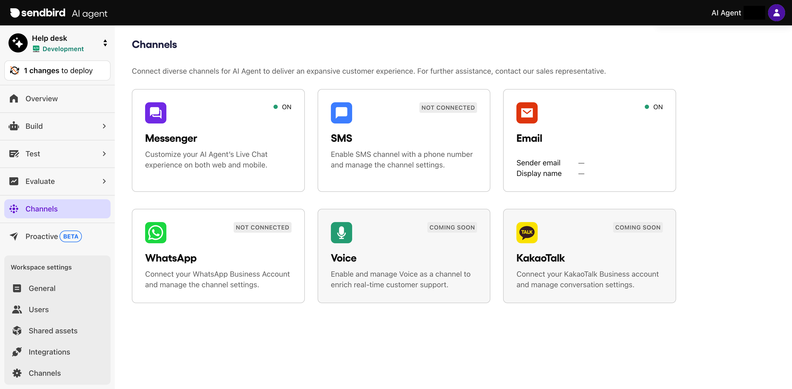
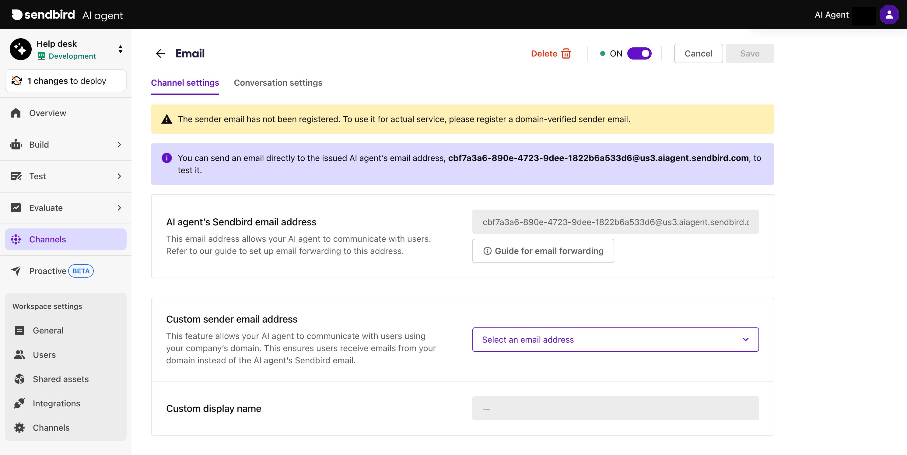
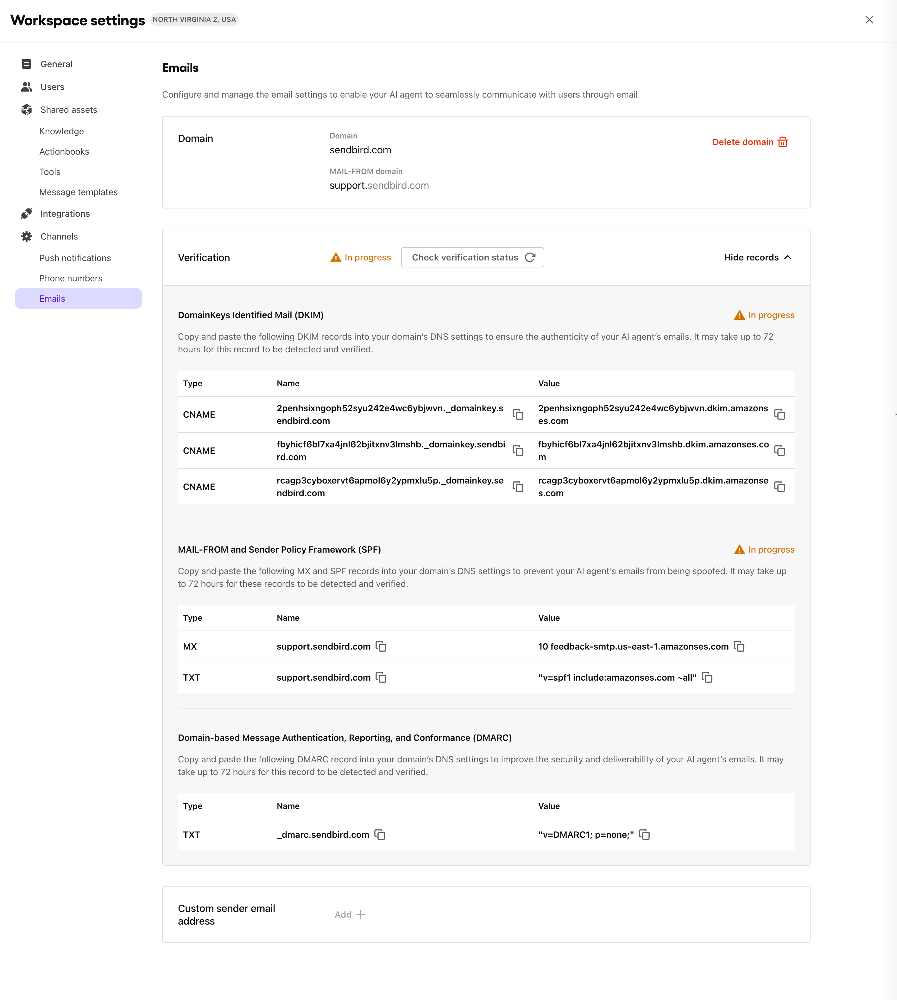
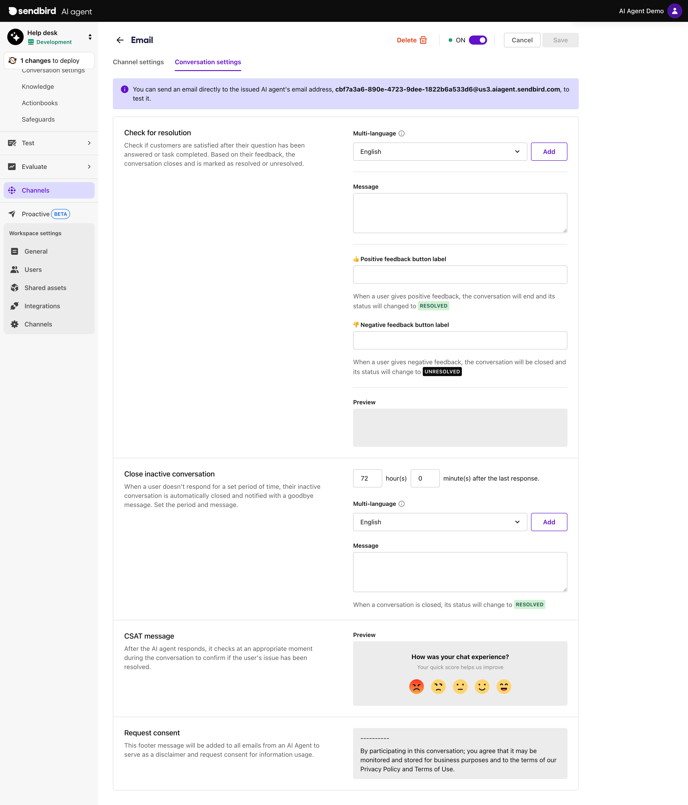

# Email

Sendbird AI Agent supports omni-channel customer service, from your in-app channels to traditional ones like **Email**. To enable email support, register your company domain in Sendbird AI Agent Dashboard, create a Custom sender email address, and configure the Domain Name System (DNS) to ensure your AI agent's emails aren't filtered as spam.

In the **Email** channel settings, you can manage the configuration and authentication settings of your business’ email communications. This includes:

* Registering your business domain and custom sender name to ensure all outgoing emails align with your brand identity.
* Viewing and managing Domain Name System (DNS) records (DKIM, SPF, and DMARC) to authenticate your MAIL-FROM email addresses and ensure email deliverability.
* Adding and managing MAIL-FROM email addresses that your AI Agent will use to communicate with users.
* Configuring the Email channel settings to customize how emails are sent, received, and handled within your AI agent environment.

***

## **How to connect**

### **Step 1: Create a Sendbird email for AI agent**

When you enable the Email channel, it will automatically create a Sendbird email for the AI agent. You will need to connect this email to your company domain and a Custom sender email address so that your AI agent can communicate with users on behalf of your brand.

1. Go to **Channels** on the left menu bar in Sendbird AI agent dashboard.
2. Click the **Email** tile.

<figure><figcaption></figcaption></figure>

3. Confirm that you will add an email channel for the AI Agent.

<figure><figcaption></figcaption></figure>

3. Once the email channel is enabled, you will see an email address auto-generated for your AI agent in the **Channel settings** tab.

<figure><figcaption></figcaption></figure>

### **Step 2: Register your email domain**

For unified communication, we highly recommend that you register your email domain first in **Workspace settings > Channels > Emails** and create a new email address dedicated for your AI agent. This new address will be used as **Custom sender email address** in the **Channel setting** tab from the previous step. It will ensure that all your customer support emails are forwarded to your AI agent while any emails sent by the AI agent will be delivered via the **Custom sender email address**.

First, set up the email domain and register AI agent’s DNS records to your domain service as follows.

1. Go to **Workspace settings > Channels > Emails** in Sendbird AI agent Dashboard.
2. Click **Add +** to add a domain that your business mainly uses.

<figure><figcaption></figcaption></figure>

3. Enter your company **Domain URL** and **MAIL-FROM domain URL**.

* **Domain**: the domain your brand mainly use for the customer support communication.
* **MAIL-FROM domain**: the hidden domain that will be part of a new email address used by your AI agent when it sends out emails. This domain helps identify and authenticate the source of the email, ensuring that it is recognized as coming from a legitimate and trusted source associated with your brand.


Your MAIL-FROM domain won't be displayed to your users when they receive emails from the AI Agent.


<figure><figcaption></figcaption></figure>

4. Once the domains are set, you will see **DomainKeys Identified Mail** (DKIM), **Amazon SES** (SPF), and **Domain-based Message Authentication, Reporting, and Comformance** (DMARC) records assigned to your AI agent. Copy and paste these records to your DNS settings to ensure the emails sent from your AI Agent aren’t filtered as spam.


To learn more about how to set up these records to your DNS configurations, expand the guide below.


<details>

<summary>Configure DNS Settings for Sendbird’s AI Agent</summary>

To ensure the AI Agent’s outgoing emails are delivered reliably and not flagged as spam, you must properly configure DNS records for Sender Policy Framework (SPF), DomainKeys Identified Mail (DKIM), and Domain-Based Message Authentication, Report & Conformance (DMARC). These authentication mechanisms help verify that your AI Agent is authorized to send emails on behalf of your domain.

This guide provides step-by-step instructions for setting up each of these email authentication protocols in your DNS provider (e.g., Cloudflare, GoDaddy, AWS Route 53).\\

1. Configure SPF.
   1. How to Add an SPF Record.
      1. Log in to your DNS provider’s dashboard.
      2. Find the option to add a new TXT record.
      3. Go to **Workspace settings > Channels > Emails** in **Sendbird AI agent Dashboard**. Under **Verification**, you will find the following details for **SPF**:
         1. Type: TXT and MX
         2. Host/Name: your MAIL-FROM domain
         3. Value: the value specified for your MAIL-FROM domain

```
v=spf1 include:_spf.aiagent.sendbird.com ~all  
```

2. Configure DKIM.
   1. How to Add a DKIM Record.
      1. Go to **Workspace settings > Channels > Emails** in **Sendbird AI agent Dashboard**.
      2. Copy and paste all three CNAMEs provided into your DNS provider’s dashboard:
         1. Type: CNAME
         2. Host/Name: This varies by your domain. An example can be `default._domainkey.yourdomain.com`.
         3. Value: This varies by your domain. An example can be `default.dkim.amazonses.com`.
3. Configure DMARC.
   1. How to Add a DMARC Record.
      1. Go to your DNS provider and add a TXT record.
      2. Go to **Workspace settings > Channels > Emails** in **Sendbird AI agent Dashboard**. Under **Verification**, you will find the following details for DMARC:
         1. Type: TXT
         2. Host/Name:`_dmarc.yourdomain.com`
         3. Value: This varies by your settings. This will contain the DMARC policy level value as described below.

<table data-header-hidden><thead><tr><th width="229.58203125"></th><th></th></tr></thead><tbody><tr><td><strong>DMARC Policy Level</strong></td><td><strong>Description</strong></td></tr><tr><td>p=none</td><td>Only monitors email traffic, no filtering.</td></tr><tr><td>p=quarantine</td><td>Suspicious emails go to spam.</td></tr><tr><td>p=reject</td><td>Blocks emails that fail SPF/DKIM checks.</td></tr></tbody></table>


💡 Tip: Start with p=none for monitoring and adjust over time to p=quarantine or p=reject based on reports. If you have an existing DMARC rule, it’s not necessary to change your existing rule.


Once you’ve set up SPF, DKIM, and DMARC, check if all records have been successfully detected and verified through your DNS by clicking the Check verification status button under **Workspace settings > Channels > Emails** in **Sendbird AI agent Dashboard**.

<figure><figcaption><p><strong>Check verification status</strong> button</p></figcaption></figure>

</details>

5. After updating the DNS settings, click the **Check verification status** button to check if DKIM and SPF are properly authenticated.
6. If authenticated, you can add any email addresses to **Custom sender email addresses**. These custom addresses will mask the sender email address of your AI agent's outgoing emails, displaying the specified **Custom sender email address** in your user's inbox instead of its Sendbird email address.

<figure><figcaption></figcaption></figure>

### **Step 3: Set up custom email forwarding rules**

Now, set up the email forwarding rules so that your AI agent can safely receive emails coming from users at the **Custom sender email address**.

Here, we walk you through the forward setting process for the most popular email domain services:

* [Google](email.md#how-to-set-forwarding-on-google-admin-console)

<details>

<summary>How to set forwarding on Google Admin Console</summary>

1. Access the **Google Admin Console**.

* Open[ Google Admin Console](https://admin.google.com/) in your web browser. Make sure to log in with an administrator account that has permissions to modify email routing settings.

<figure><figcaption></figcaption></figure>

2. Enable **Automatic Forwarding**.

* In Admin Console, navigate to **Apps > Google Workspace > Gmail > Routing**.

<figure><figcaption></figcaption></figure>

3. Create a **New Routing Rule**.
   1. Scroll down to the **Email Forwarding Using Recipient Address Map** section.
   2. In the **Routing** section, click **Add Another Rule** to create a forwarding rule.

<figure><figcaption></figcaption></figure>

c. Assign a descriptive name, such as **Forward Support Emails to AI Agent**, to easily identify the rule later.

d. Click **Save** to add the configured rule.

<figure><figcaption></figcaption></figure>


For additional information, refer to [Google's guide](https://support.google.com/mail/answer/10957?hl=en).


</details>

* [Microsoft Outlook](email.md#how-to-set-forwarding-on-microsoft-outlook)

<details>

<summary>How to set forwarding on Microsoft Outlook</summary>

1. Go to **Settings** on Outlook.
   1. Click the **gear icon** ⚙️ (Settings) at the top right corner.
2. Go to **Mail Settings**.
   1. From the left panel, click **Mail**.
   2. Select **Forwarding and IMAP** from the options.

<figure><figcaption></figcaption></figure>

3. Enable **Email Forwarding**.
   1. Check **Enable forwarding**.
   2. Enter the email address automatically generated for your AI Agent in the **Forward my email to** field.

<figure><figcaption></figcaption></figure>

4. Choose your preferences and save the settings.
   1. (Optional) If you want to retain a copy of forwarded emails in Outlook, select **Keep a copy of forwarded messages**.
   2. Click **Save** at the bottom to apply your forwarding rules.

<figure><figcaption></figcaption></figure>

</details>


Before setting up email forwarding rules, ensure your domain allows automatic forwarding. If forwarding isn’t enabled, the rules won’t work, and emails won’t reach your AI Agent.


### **Step 4: Configure the channel settings**

Once you’ve set your custom sender email address, go to the Conversation settings tab and configure the system messages such as a resolution message and goodbye message.

<figure><figcaption></figcaption></figure>

#### **Check for resolution**

The resolution message will be sent to the end user when an AI Agent detects resolution in the conversation. It will be provided along with positive and negative response options that the user can choose from.

#### **Close inactive conversation**

You can configure how long your AI agent will wait for a user’s response until it automatically closes an email conversation. Set the time period and message that will be sent when an Email conversation is closed.

**Channel connection status**

Once the channel is enabled, the `ON` label will appear on its tile along with the registered email address and its custom display name. Click on its tile to edit its settings or even delete the channel.

<figure><figcaption></figcaption></figure>

***

## Handling CC and BCC’d Emails

If users include the help center email address or others as a carbon copy (CC) in their inquiry emails, the AI agent will respond in accordance to the following policy:

* If an end user carbon-copies or below-carbon-copies an AI agent in their email, the agent will only reply to the original sender.
* If an end user carbon-copies or blind-carbon-copies someone else in their email to an AI agent, the agent will only reply to the original sender.
