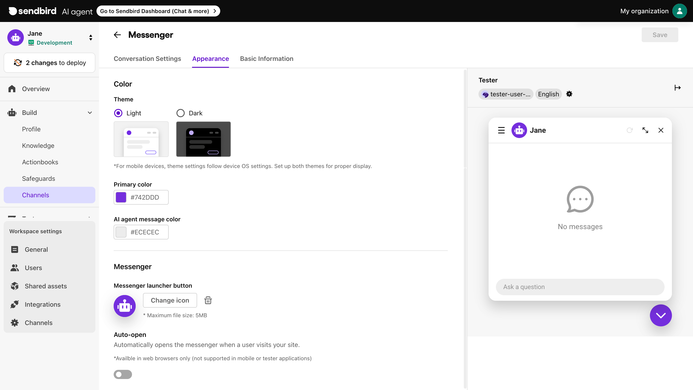

# Appearance

In the **Appearance** tab of the **Messenger** menu, you can customize the look and feel of your AI agent messenger to align with your brand identity. You can adjust the theme, primary color, and message color as well as the messenger icon to complement your website or application design. With the Auto-open feature, you can also control whether the messenger launches automatically when users visit your site.

<figure><figcaption></figcaption></figure>
