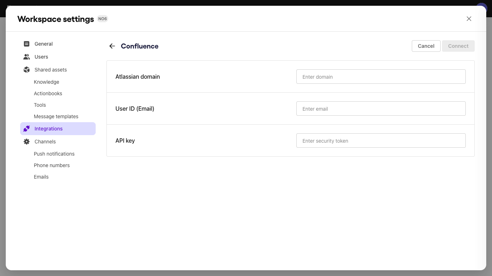

# Confluence

The Confluence integration with Sendbird AI Agent enables us to extract all the internal spaces and pages that you've created. This integration allows you to:

* Leverage Confluence pages for instant answers: By integrating with Confluence, AI Agents can access all knowledge base content in the platform. This allows the AI Agent to retrieve relevant articles, FAQs, and documentation to provide accurate, self-serve responses before escalating to human support.

***

## **How to integrate**

### **Step 1: Fill in your Confluence credentials in Sendbird**

Under **Workspace settings > Integrations > Confluence** on **Sendbird AI agent dashboard**, enter the following credentials:

<table><thead><tr><th width="189.5078125">Credential</th><th>Description</th></tr></thead><tbody><tr><td>Atlassian domain</td><td>Enter the Confluence domain that you are currently using. (e.g., yourDomain.atlassian.net)</td></tr><tr><td>User ID (email)</td><td>Enter the user email of your Confluence account.</td></tr><tr><td>API key</td><td>The unique API key issued for your account. Sendbird AI agent will require this in order to authenticate its request to your Confluence account. Refer to <a href="https://support.atlassian.com/atlassian-account/docs/manage-api-tokens-for-your-atlassian-account/">Atlassian's guide on how to manage API key</a>s.</td></tr></tbody></table>

<figure><figcaption></figcaption></figure>

### Step 2: **Click Connect**

Once you've entered all the required credentials, click **Connect** at the top-right corner of the browser. You will then see a confirmation label on the **Confluence** tile indicating that the integration has been successfully established.

<figure><figcaption></figcaption></figure>

***

## **What's next**

### **Connect a Confluence space as knowledge**

If you have Confluence spaces that your AI agent can reference, go to the [Shared assets > Knowledge](../shared-assets/knowledge.md) menu in the dashboard and connect it to Sendbird AI agent. Once connected, we’ll pull all pages inside the selected Spaces.

See our guide on [Knowledge](../shared-assets/knowledge.md) for more information.
