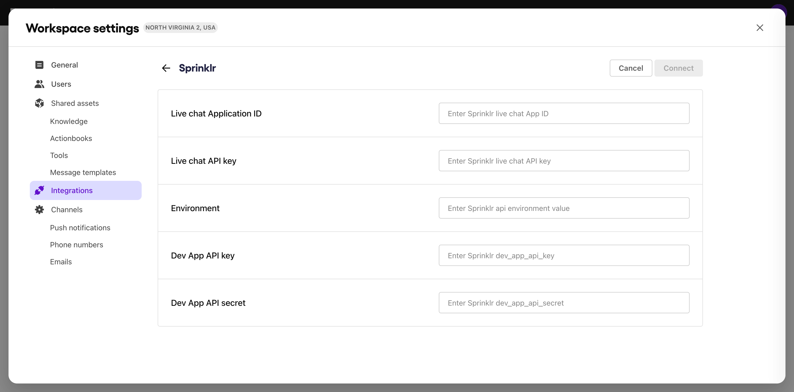

# Sprinklr

The Sprinklr integration with Sendbird’s AI Agent facilitates seamless customer experience by blending intelligent automation with human assistance. This integration allows AI agent to:

* Hand off conversations to human agents: For complex queries or escalations, AI Agent can transfer conversations to human agents in Sprinklr. The integration ensures that agents receive full conversation context, enabling faster and more personalized customer service.
* Leverage Sprinklr articles for instant answers: If you already have multiple customer support articles in Sprinklr, AI agents can easily reference them when handling user queries, instead of you building it from scratch.


Self-serve integration is currently not supported. Contact a Sendbird representative to connect Sprinklr with Sendbird AI agent.


***

## How to integrate

### Step 1: Provide your Sprinklr API credentials.

As of May 12, 2025, the integration can be established by Sendbird upon your request. To integrate, Sendbird will need the following information:

* **Live chat application ID** and **API key**
* **Environment**
* **Sprinklr Dev portal application's API key** and **API secret**


For more information, refer to [Sprinklr's guide on API key generation](https://dev.sprinklr.com/api-key-and-secret-generation).


Once we connect your account to the AI agent, you can find your Sprinklr API integration settings under **Workspace settings > Integration > Sprinklr** on **Sendbird AI agent dashboard**.

<figure><figcaption></figcaption></figure>

Also, you will see a `CONNECTED` label on the **Sprinklr** tile indicating that the integration has been successfully established.

<figure><figcaption></figcaption></figure>

***

## What's next

### Connect Sprinklr account as knowledge.

If you have any guidelines or articles that your AI agent can reference, go to the [Shared assets > Knowledge](../shared-assets/knowledge.md) menu in the dashboard and connect them to Sendbird AI agent.
