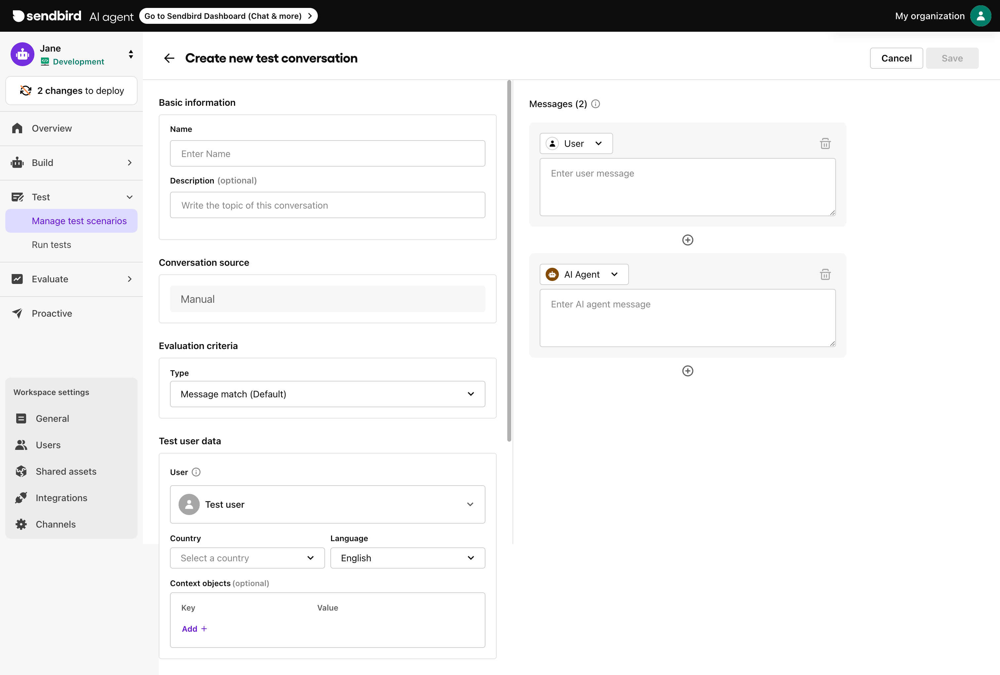

# Manage test scenarios

**Manage test scenarios** page allows you to create and manage test scenarios, which represent ideal interactions between a user and your AI agent. These conversations define what a "correct" response should look like and are used later in [test sets](run-tests.md#what-is-a-test-set) to evaluate your agent's performance.



***

## Creating a test scenario

You can create a test scenario by uploading a CSV, importing from real conversations, or creating one manually.

### Using a CSV file

<figure><figcaption></figcaption></figure>

1. Log into your [Sendbird AI agent dashboard](https://dashboard.sendbird.com/).
2. Go to the Manage test scenarios page under **AI agent > Test > Manage test scenarios.**
3. Click **Create > Create from CSV.**
4. Enter the following fields:

<table><thead><tr><th width="170.140625">Field</th><th>Description</th></tr></thead><tbody><tr><td>Title</td><td>The title of your test conversation.</td></tr><tr><td>Description (optional)</td><td>The topic of this conversation.</td></tr><tr><td>Evaluation criteria</td><td><ul><li><strong>Semantic similarity (Default)</strong> Determine if the AI agent’s response captures the general intent of the expected response. Minor differences in names, phrasing, or details are acceptable as long as the core idea is preserved.</li><li><strong>Semantic similarity (Strict)</strong> Evaluate whether the AI agent’s response fully matches the intended meaning of the expected response.</li></ul></td></tr><tr><td>Source</td><td>
Upload CSV file(s) containing an ideal customer-agent interaction. Follow the following format:
<ul><li>Up to 100 messages (rows)</li><li>Maximum file size: 1 MB</li><li>Must be labeled with column headers: <strong>role</strong>, <strong>text</strong></li><li>Accepted values for the role column: <strong>USER, AI_AGENT</strong> (USER row must come first)</li></ul>
 [Sample — Download sample <a href="manage-test-scenarios.md#sample-test-conversatio">here</a>] <strong>USER</strong> | Hi, I would like to cancel my membership. <strong>AI_AGENT</strong> | I can help you with that. May I ask why you're looking to cancel your membership? <strong>USER</strong> | I'm not using it as much anymore. <strong>AI_AGENT</strong> | Thank you for letting us know. I’ll guide you through the cancellation process. Are you ready to proceed now? <strong>USER</strong> | Yes. <strong>AI_AGENT</strong> | Got it. Please click [here]() or go to your account settings > Membership > Cancel to complete the cancellation. Let me know if you need help at any point.
</td></tr><tr><td>Test user data</td><td>
Information used to simulate user-specific conditions and evaluate how the AI agent responds in realistic, production-like scenarios. 
<ul><li>
<strong>User ID</strong>

The Sendbird user ID. You can find users in <strong>Workspace settings > Users</strong>. Different users may have unique attributes that can influence AI response.
</li><li>
<strong>Country</strong> Specifies the test user's country. (Default: <strong>None</strong>)
<ul><li><code>None</code>: Indicates no country is set for the user.</li><li>If no country is set, the AI agent will only use shared assets (e.g., Knowledge, Actionbooks) labeled "All countries."</li><li>If a country is set, (e.g., Korea), the AI agent will use shared assets labeled "All countries" and "Korea."</li></ul></li><li>
<strong>Language</strong> (required) Select the language of the test user. Your AI agent will respond using content in that language — if it exists.
<ul><li>If a multi-language supported feature or Knowledge is available in the selected language, it will be used as-is.</li><li>
If it's not available, the AI will:
<ul><li>Use the default language version of the message to translate it to the user's selected language.</li></ul></li></ul></li><li><strong>Context objects</strong> Up to 5 key-value pairs that simulate additional metadata (e.g., membership = premium, device = iOS). </li></ul>
These fields ensure your test conversations reflect how the AI agent would behave in real-world scenarios, with proper localization and user context.
</td></tr></tbody></table>

5. Then, **Save** the test scenario.

#### Sample test conversation


Download sample test conversation here.


### Creating manually

1. Log into your [Sendbird AI agent dashboard](https://dashboard.sendbird.com/).
2. Go to the Manage test scenarios page under **AI agent > Test > Manage test scenarios.**
3. Click **Create > Create manually.**
4. Enter the following fields:

<table><thead><tr><th width="170.140625">Field</th><th>Description</th></tr></thead><tbody><tr><td>Title</td><td>The title of your test conversation.</td></tr><tr><td>Description (optional)</td><td>The topic of this conversation.</td></tr><tr><td>Evaluation criteria</td><td><ul><li><strong>Semantic similarity (Default)</strong> Determine if the AI agent’s response captures the general intent of the expected response. Minor differences in names, phrasing, or details are acceptable as long as the core idea is preserved.</li><li><strong>Semantic similarity (Strict)</strong> Evaluate whether the AI agent’s response fully matches the intended meaning of the expected response.</li></ul></td></tr><tr><td>Test user data</td><td>
Information used to simulate user-specific conditions and evaluate how the AI agent responds in realistic, production-like scenarios. 
<ul><li>
<strong>User ID</strong>

The Sendbird user ID. You can find users in <strong>Workspace settings > Users</strong>. Different users may have unique attributes that can influence AI response.
</li><li>
<strong>Country</strong> Specifies the test user's country. (Default: <strong>None</strong>)
<ul><li><code>None</code>: Indicates no country is set for the user.</li><li>If no country is set, the AI agent will only use shared assets (e.g., Knowledge, Actionbooks) labeled "All countries."</li><li>If a country is set, (e.g., Korea), the AI agent will use shared assets labeled "All countries" and "Korea."</li></ul></li><li>
<strong>Language</strong> (required) Select the language of the test user. Your AI agent will respond using content in that language — if it exists.
<ul><li>If a multi-language supported feature or Knowledge is available in the selected language, it will be used as-is.</li><li>
If it's not available, the AI will:
<ul><li>Use the default language version of the message to translate it to the user's selected language.</li></ul></li></ul></li><li><strong>Context objects</strong> Up to 5 key-value pairs that simulate additional metadata (e.g., membership = premium, device = iOS). </li></ul>
These fields ensure your test conversations reflect how the AI agent would behave in real-world scenarios, with proper localization and user context.
</td></tr></tbody></table>

5. Manually enter user message and AI agent messages on the right panel to create an ideal conversation.

<figure><figcaption></figcaption></figure>

5. Then, **Save** the test scenario.

### Using user conversation

1. Log into your [Sendbird AI agent dashboard](https://dashboard.sendbird.com/).
2. Go to the Conversation details page under your **AI agent > Evaluate > Conversations**.
3. Click **Create test conversation** in the top-right corner.
4. Enter the following fields:

<table><thead><tr><th width="170.140625">Field</th><th>Description</th></tr></thead><tbody><tr><td>Title</td><td>The title of your test conversation.</td></tr><tr><td>Description (optional)</td><td>The topic of this conversation.</td></tr><tr><td>Evaluation criteria</td><td><ul><li><strong>Semantic similarity (Default)</strong> Determine if the AI agent’s response captures the general intent of the expected response. Minor differences in names, phrasing, or details are acceptable as long as the core idea is preserved.</li><li><strong>Semantic similarity (Strict)</strong> Evaluate whether the AI agent’s response fully matches the intended meaning of the expected response.</li></ul></td></tr><tr><td>Source</td><td>Specifies the imported user conversation.</td></tr><tr><td>Test user data</td><td>
Information used to simulate user-specific conditions and evaluate how the AI agent responds in realistic, production-like scenarios. 
<ul><li>
<strong>User ID</strong>

The Sendbird user ID. You can find users in <strong>Workspace settings > Users</strong>. Different users may have unique attributes that can influence AI response.
</li><li>
<strong>Country</strong> Specifies the user's country. (Default: <strong>None</strong>)
<ul><li><code>None</code>: Indicates no country is set for the user.</li><li>If no country is set, the AI agent will only use shared assets (e.g., Knowledge, Actionbooks) labeled "All countries."</li><li>If a country is set, (e.g., Korea), the AI agent will use shared assets labeled "All countries" and "Korea."</li></ul></li><li>
<strong>Language</strong> (required) Select the language of the test user. Your AI agent will respond using content in that language — if it exists.
<ul><li>If a multi-language supported feature or Knowledge is available in the selected language, it will be used as-is.</li><li>
If it's not available, the AI will:
<ul><li>Use the default language version of the message to translate it to the user's selected language.</li></ul></li></ul></li><li><strong>Context objects</strong> Up to 5 key-value pairs that simulate additional metadata (e.g., membership = premium, device = iOS). </li></ul>
These fields ensure your test conversations reflect how the AI agent would behave in real-world scenarios, with proper localization and user context.
</td></tr></tbody></table>

\
5\. Then, **Save** the test conversation.

***

## Viewing test scenario details

Once a test conversation has been created, you can view its setup and history details.

* **Metadata** such as title, description, number of user messages, source and evaluation criteria.
* **Test user data** including language, country, user ID, and any context objects applied.
* **Conversation thread** showing the user message and the expected AI agent response, extracted from the source (either CSV file or a past user conversation).
* **Test result history,** listing previous test runs that include this conversation and whether they passed or failed.


**Note:** Only test results from the current environment (Development or Production) are shown.


This view helps you verify what scenarios are being tested, see how the AI responds under different user contexts, and easily reuse the conversation in new test sets.
